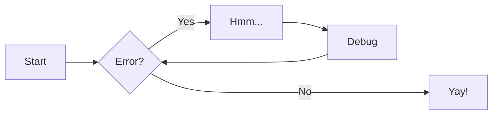

# MkDocs 문서 생성

- [**MkDocs:**](https://www.mkdocs.org) 코드의 documentation을 모아 문서화하는 프로그램.
- mkdocs-material theme 사용
- https://github.com/mkdocstrings/mkdocstrings repo의 mkdocs.yml 참고하면 좋음
    - 결과 예시 [https://mkdocstrings.github.io/](https://mkdocstrings.github.io/)

## Project layout 및 사용법

```sh
📄 mkdocs.yml   # The configuration file.
📂 docs/
│ ✏️ index.md    # The documentation homepage.
└ ✏️ ...         # Other markdown pages, images and other files.
```

1. 마크다운 형식으로 `docs/` 폴더 내에 문서 작성.
2. `mkdocs.yml` 파일의 nav: 항목을 수정해 페이지 추가.
3. `mkdocs` 프로그램으로 문서 미리보기
    - `uv pip install -r deps/requirements_docs.txt` - mkdocs 및 플러그인 설치
    - `mkdocs serve` - 문서 미리보기 (수정 사항 즉시 반영)
4. GitHub Actions를 통해 자동으로 document 생성 및 GitLab 호스팅 (`.github/workflows/docs.yml`)
    - Mike 플러그인을 이용해 생성된 문서의 버전 관리하게 되어있음. 없으면 최신버전 문서만 나옴.


## Markdown Examples

### Code Annotation 

#### With a title

```python title="bubble_sort.py"
def bubble_sort(items):
    for i in range(len(items)):
        for j in range(len(items) - 1 - i):
            if items[j] > items[j + 1]:
                items[j], items[j + 1] = items[j + 1], items[j]
```

#### With line numbers

```python linenums="1"
def bubble_sort(items):
    for i in range(len(items)):
        for j in range(len(items) - 1 - i):
            if items[j] > items[j + 1]:
                items[j], items[j + 1] = items[j + 1], items[j]
```

#### Highlighting lines

```python hl_lines="2 3"
def bubble_sort(items):
    for i in range(len(items)):
        for j in range(len(items) - 1 - i):
            if items[j] > items[j + 1]:
                items[j], items[j + 1] = items[j + 1], items[j]
```

### Icons and Emojis

:smile: 

:fontawesome-regular-face-laugh-wink:

:fontawesome-brands-twitter:{ .twitter }

:octicons-heart-fill-24:{ .heart }

### Flow Chart with [Mermaid](https://mermaid.js.org/intro)


